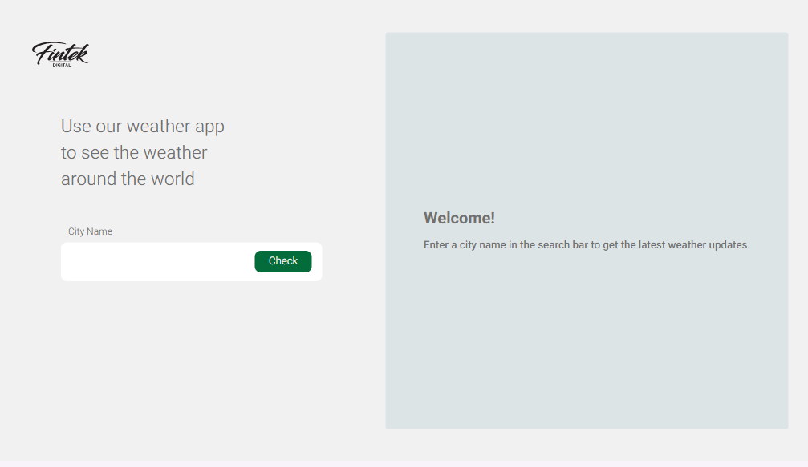
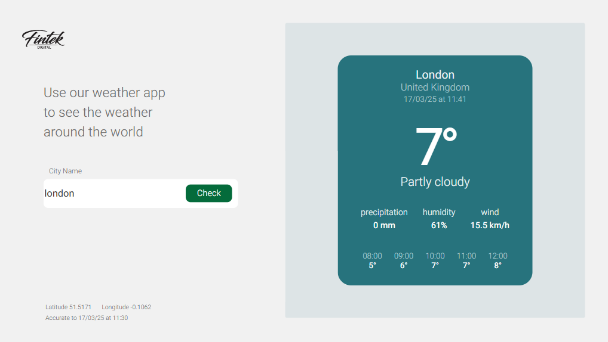

# Weather App ☂️⛅☀️  

## תיאור הפרויקט  
אפליקציה לחיזוי מזג האוויר בזמן אמת לפי שם עיר.  
הפרויקט מבוסס על **React** בצד הלקוח ו-**Node.js** בצד השרת.  
האפליקציה מציגה את מזג האוויר הנוכחי, טמפרטורות לשעות הקרובות והשוואה לשעות קודמות.  

## טכנולוגיות   
- **Frontend:** React, Vite  
- **Backend:** Node.js, Express  
- **State Management:** React Hooks  
- **API:** WeatherAPI  
- **Request Library:** Axios  
- **Environment Variables:** dotenv  
- **CORS:** מאפשר בקשות בין צד השרת לצד הלקוח  

## כיצד להשתמש?   

### צד הלקוח  
1. הזן את שם העיר בתיבת הטקסט.  
2. לאחר שליחה, תוצג הטמפרטורה של מזג האוויר הנוכחי בעיר המבוקשת.  
3. האפליקציה מציגה גם את הטמפרטורות לשעה הקרובה והשוואה למזג האוויר בשעות קודמות.  

### צד השרת  
השרת מקבל בקשות `GET` לנתיב:  

```
/weather/:city
```

כאשר `city` הוא שם העיר.  

לדוגמה, בקשה לעיר **Tel Aviv**:  

```
GET /weather/Tel Aviv
```

## איך להריץ את הפרויקט?   

### 1️⃣ התקנת התלויות  
```sh
cd client  
npm install  

cd ../server  
npm install  
```

### 2️⃣ הגדרת מפתחות API  
הפרויקט דורש **מפתח API** כדי להתחבר ל-WeatherAPI.  

- הירשם לחשבון ב-WeatherAPI.  
- הוסף את המפתח שלך לקובץ `.env` בתיקיית השרת:  

```sh
API_KEY=YOUR_API_KEY
```

### 3️⃣ הרצת הפרויקט  
פתח שני טרמינלים:  

**טרמינל ראשון (שרת):**  
```sh
cd server  
node server.js  
```

**טרמינל שני (לקוח):**  
```sh
cd client  
npm run dev  
```
## נראות סופית





